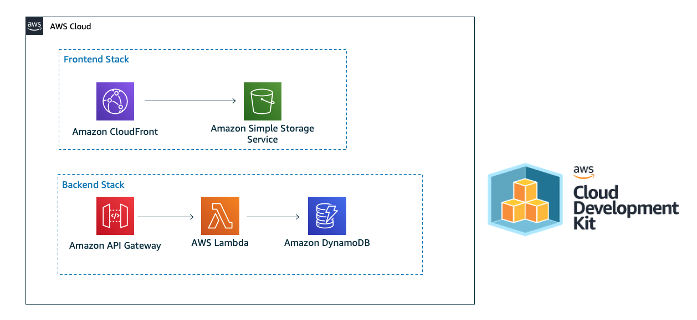

# Live Coding Application 

This repo contains code for Live Coding session at PostNL Symposium

# What we built in the session
  

We have built all components but frontend doesn't have the API URL yet.

# What's done after the session
We've completed the `FrontendConfig` stack. You could check the change in commit a547c17. 

